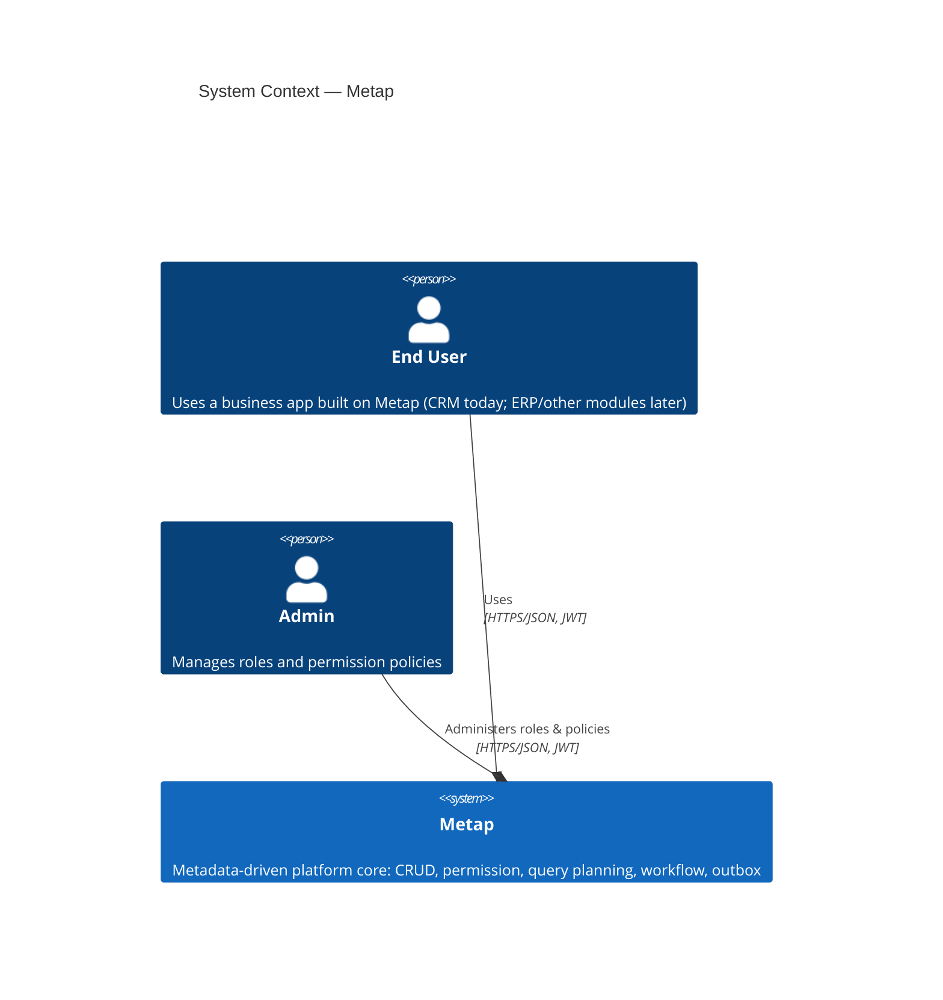

# 3. Phạm vi và Context Hệ thống

## Context Nghiệp vụ

| Actor | Tương tác |
|---|---|
| End User | Sử dụng một business app xây dựng trên Metap (CRM hiện tại) — tạo/đọc/cập nhật records, list/filter/search, thực hiện workflow transitions |
| Admin | Grant/revoke role cho từng user, quản lý các permission policy ở cấp field và record, thông qua các admin-gated HTTP route `/admin/*` (`crates/metap-http/src/routes/admin.rs`) |

Ngoài phạm vi hiện tại: chưa có payment gateway. Có một vài tích hợp hệ thống bên ngoài, tất cả opt-in/config-driven, không phải mặc định: gửi email qua SMTP (`TargetType::Email` của `metap-cron`/`cron-scheduler`, `docs/roadmap.md` Phase 39), gọi webhook ngoài tùy ý (`TargetType::Webhook`), và auth pluggable theo tenant gồm cả OIDC làm third-party identity provider (`metap-auth`, `docs/roadmap.md` Phase 25) bên cạnh local username/password mặc định (`docs/roadmap.md` Phase 15, từ 2026-08-09) — `POST /auth/login` verify với bảng `users` và tự mint một JWT.

## C4 Level 1: Context Hệ thống

Metap chưa có payment gateway — các actor duy nhất hiện tại là end user và admin của bất kỳ business app nào được xây dựng trên nền tảng này. Các tích hợp bên ngoài đã có (SMTP email, webhook ngoài, OIDC identity provider) đều opt-in qua config, không xuất hiện trong sơ đồ Context ở trên vì chúng không phải actor mà platform trực tiếp tương tác theo nghĩa C4 System Context — xem "Context Kỹ thuật" bên dưới.

## Context Kỹ thuật

- **Protocol**: REST qua HTTPS, JSON body, `Authorization: Bearer <JWT>`.
- **Auth**: RS256 JWT, được Metap tự mint và tự verify — `POST /auth/login` (email+password kiểm tra với bảng `users`, argon2id) mint bằng private key (`AUTH_JWT_PRIVATE_KEY_PATH`); mọi route khác verify bằng public key (`AUTH_JWT_PUBLIC_KEY_PATH`). Role *không* được mang trong JWT; chúng được tra cứu lại (fresh) cho mỗi request từ `user_roles` (xem [05. Building Block View](05-building-blocks.md)).
- **Errors**: JSON error body có cấu trúc, kèm request id và trace id (`crates/metap-http`).
- **Events out**: RabbitMQ, AMQP 0-9-1, thông qua transactional outbox — không tồn tại cơ chế webhook/callback đồng bộ nào.
