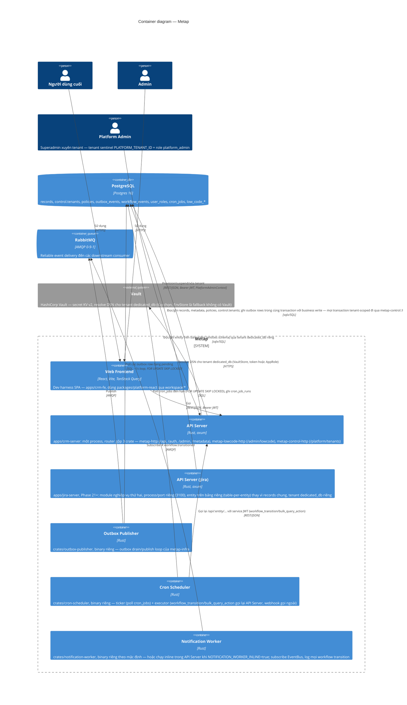
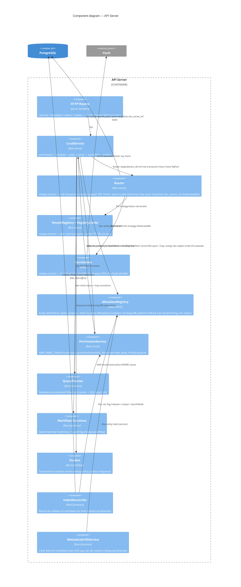
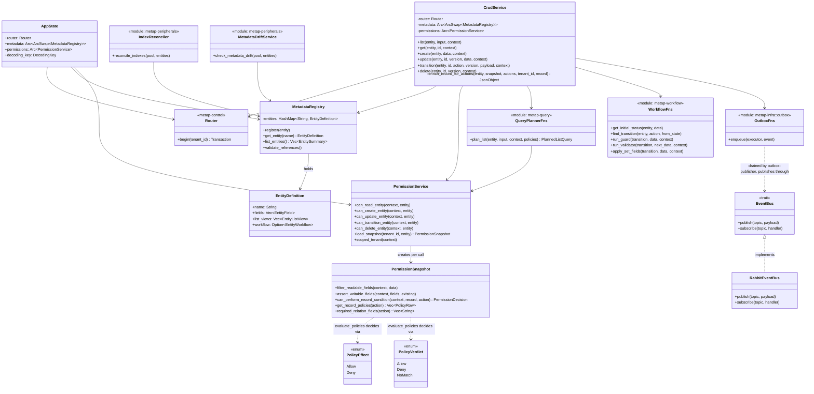
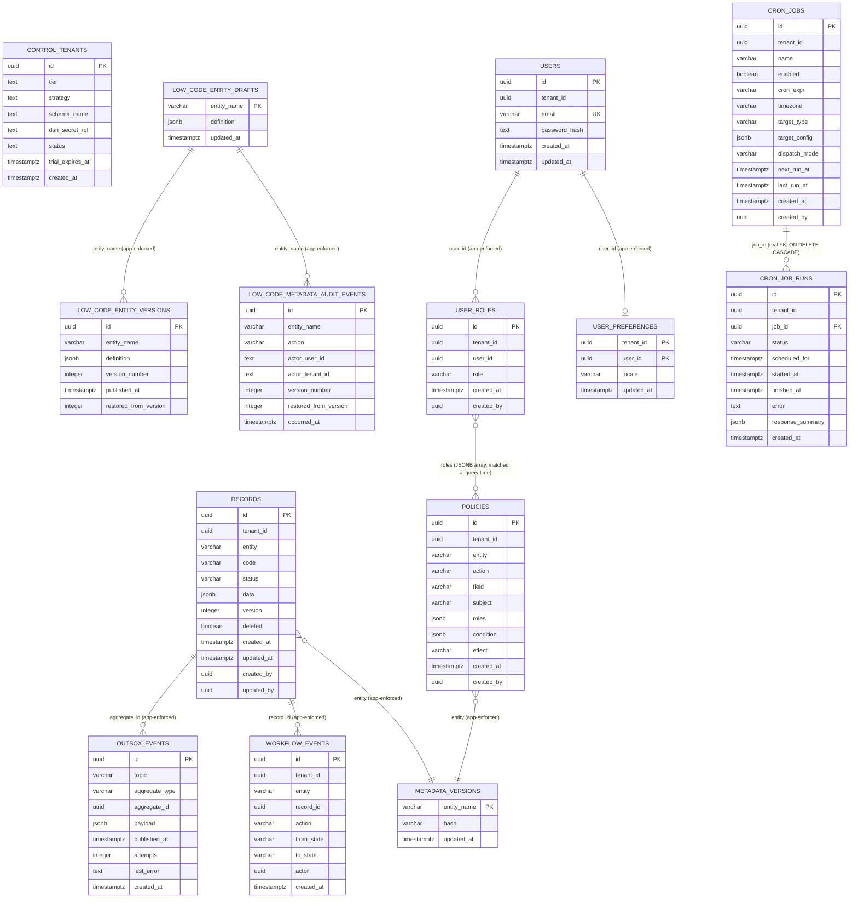

# 5. Building Block View

## Các layer cấp cao

```txt
axum routes (crates/metap-http/src/routes/*)
  -> application service (crates/metap-crud/src/crud_service.rs)
    -> platform core (metap-metadata / metap-permission / metap-query / metap-workflow)
      -> PostgreSQL (sqlx::PgPool, injected directly — no repository abstraction; see
         docs/architectures/09-adr.md for why)
      -> outbox (metap-infra::outbox::enqueue) -> RabbitMQ (metap-infra::EventBus)
```

## C4 Level 2: Containers



API Server, Outbox Publisher, Cron Scheduler, và Notification Worker (khi không chạy inline) là các process tách biệt một cách có chủ ý — khi RabbitMQ gặp sự cố, chỉ các worker bị ngưng trệ, API không bị ảnh hưởng, vì transactional outbox write đã commit xong rồi. `apps/crm-server` có thể tùy chọn phục vụ luôn static files đã build của `apps/crm-fe` trên cùng process/port (`pnpm start`, cấu hình `STATIC_DIR`) — đây chỉ là một tiện lợi khi triển khai, không làm thay đổi sự tách biệt này; các worker vẫn luôn là process riêng biệt (Notification Worker là ngoại lệ duy nhất, có thể chạy inline như một background task trong chính API Server qua `NOTIFICATION_WORKER_INLINE=true` — cả hai chế độ gọi chung một hàm `notification_worker::run`, nên không thể lệch hành vi nhau).

## C4 Level 3: Components (inside the API Server)



## Logical View (class-level)

Mô hình object đứng sau component diagram ở trên — các type và cách chúng phụ thuộc lẫn nhau, không phải các đơn vị deploy. (Logical View của Kruchten 4+1.) `metap-query`/`metap-workflow` là các function module chứ không phải struct (không có state cần giữ qua từng call), được thể hiện ở đây như pseudo-class để nhất quán với phần còn lại của diagram.



## Whitebox: Core Services

### Metadata Registry

Sở hữu các entity definition:

- fields
- list views
- workflow
- index/search/sort hints

Metap validate và compile metadata như một runtime artifact hạng nhất, thay vì coi nó là một mô tả schema thụ động. `MetadataCompiler` thực thi điều này tại thời điểm `MetadataRegistry::register()` — field trùng lặp, tham chiếu field/filter/sort của listView bị treo (dangling), giá trị enum thiếu, và workflow shape sai định dạng đều khiến quá trình khởi động thất bại, chứ không phải đợi đến request đầu tiên. Mỗi entity có một hash xác định (deterministic) cho hình dạng của nó (`MetadataCompiler::hash`, gồm cả guard condition của từng workflow transition kể từ 2026-08-17), được expose dưới dạng `version` tại `GET /metadata/entities`; `MetadataDriftService` so sánh hash đó với hash được ghi nhận lần gần nhất mỗi khi boot và chỉ cảnh báo — không bao giờ crash — khi có drift, phản ánh đúng tinh thần graceful-degradation của health check. Cùng bản chiếu metadata an toàn đó cũng là nguồn cho tài liệu OpenAPI được sinh ra tại `GET /metadata/openapi.json` (viết tay trong `metap-metadata/src/openapi.rs`, được đồng bộ thủ công với các struct trong `entity.rs` — Rust không có bước runtime-reflection tương đương Zod).

### Control Plane (Router, Multi-Tenancy)

`metap-control` (`docs/multi-tenant-platform-design.md` §2.2, `docs/roadmap.md` Phase 16) — control plane cho SaaS multi-tenancy, sở hữu:

- **`control.tenants`** — registry một dòng mỗi tenant (`id`, `tier`, `strategy`, `schema_name`/`dsn_secret_ref`, `status`, `trial_expires_at`), qua `TenantRegistry` trait (`PostgresTenantRegistry` là impl duy nhất) + `RegistryCache` (moka, TTL 30s) phía trước để tránh query lại mỗi request.
- **`TenantStatus`** — `Provisioning`/`Active`/`Migrating`/`Suspended`/`Expired`/`Deleted` (terminal, chỉ set qua `DELETE /platform/tenants/{id}`, không bao giờ set qua `PATCH .../status`). Mỗi status không phải `Active` map sang một mã lỗi HTTP cụ thể ở `CrudService` (`router_unavailable`) — `Suspended`/`Expired` → 403, `Migrating`/`Provisioning` → 503, `Deleted` → 404 — thay vì rơi vào nhánh lỗi 500 chung.
- **`TenantStrategy`** — `Schema { schema_name }` (trial, thực tế luôn ghim `"public"` — isolation thật cần data-plane table-per-entity, chưa xây) hoặc `DedicatedDb { dsn_secret_ref }` (paid, đã có isolation vật lý thật).
- **`Router::begin(tenant_id)`** — điểm duy nhất mở một transaction tenant-scoped, thay cho `CrudService` nhận thẳng một `PgPool`. Với `Schema`: `SET LOCAL search_path` trên connection mượn từ pool chung, scoped theo transaction (không thể rò sang request tiếp theo dùng lại cùng connection — bẫy nghiêm trọng nhất của thiết kế này, đã fix explicit). Với `DedicatedDb`: mở/tái dùng một `PgPool` riêng cho tenant đó, cache theo `dsn_secret_ref` (moka, idle TTL 10 phút). Một tenant chưa có row `control.tenants` fallback về hành vi tương thích ngược: `{status: Active, strategy: Schema("public")}`.
- **`SecretStore`** trait (`EnvStore`/`VaultStore`) — resolve DSN cho `DedicatedDb`. `EnvStore` đọc thẳng biến môi trường tên đúng bằng `dsn_secret_ref`. `VaultStore` (`crates/metap-control/src/vault_store.rs`) gọi Vault KV v2 qua HTTP, hỗ trợ token tĩnh hoặc AppRole (ưu tiên AppRole nếu có cả hai) kèm auto-renewal (`renew_self` trước, fallback login lại bằng AppRole chỉ khi renew thất bại — tránh lỗi với role có `secret_id_num_uses=1`). Chi tiết vận hành + các câu hỏi production còn bỏ ngỏ ở [07. Deployment View](07-deployment.md#secret-manager--secretstore--vaultstore-2026-08-17--2026-08-21).
- **`PostgresPolicyStore`** — sống ở `metap-control` chứ không phải `metap-permission` (thuần lý do dependency-cycle: `metap-permission -> metap-control` sẽ khép vòng lặp `metap-control -> metap-peripherals -> metap-metadata -> metap-permission`; trait `PolicyStore` vẫn ở `metap-permission`), mỗi lời gọi route qua `Router::begin`.
- **Provisioning** — `provision_schema_tenant`/`provision_dedicated_db_tenant` (ghi row `control.tenants`, chạy migration lên DB riêng khi `dedicated_db`, tạo admin user đầu tiên) dùng chung giữa `dev-tools provision-tenant` (CLI) và `POST /platform/tenants` (`metap-control-http`, gate bởi `PlatformAdminContext` — tenant sentinel `PLATFORM_TENANT_ID` + role `"platform_admin"`, khác `AdminContext` chỉ ủy quyền trong tenant của chính người gọi).
- **Delete/deprovision** (`DELETE /platform/tenants/{id}`) — chỉ detach routing (set `status: Deleted`, đóng dedicated pool nếu có), **không** tự động `DROP DATABASE` cho tenant `dedicated_db`, **không** tự động xóa data cho tenant `schema` — quyết định có chủ ý, tránh mất dữ liệu không thể hoàn tác qua một lời gọi API.

### CRUD Service

CRUD tổng quát cho các metadata entity (`metap-crud::CrudService`), là thứ duy nhất mà routes gọi để thao tác trên record.

Trách nhiệm:

- validate dữ liệu bằng validator dẫn xuất từ field metadata (`metap-crud/src/validation.rs`, thay thế cho các Zod schema riêng theo từng entity — không có một object validation-schema viết tay riêng biệt)
- thực thi permission thông qua `PermissionService`
- gọi query planner (`metap-query::plan_list`) cho list/search
- mở mọi transaction qua `Router::begin(tenant_id)` (xem "Control Plane" ở trên), không bao giờ nhận thẳng một `PgPool`
- lưu trữ record
- enqueue outbox event
- gọi các workflow function khi cần

### Permission Service

Lớp permission (`metap-permission::PermissionService`) sở hữu:

- tenant scope
- role assignment — động, lưu trong DB theo từng `(tenant_id, user_id)`, được grant/revoke ngay tại runtime qua HTTP API có bảo vệ admin (`crates/metap-http/src/routes/admin.rs`, bọc `metap-peripherals::assign_role`/`revoke_role`/`list_users`); bản thân JWT chỉ là một khẳng định danh tính trần trụi (bare identity assertion), không mang theo role
- policy storage — một allow-list theo role kết hợp với một attribute condition tùy chọn (`PolicyCondition`), đứng sau trait `PolicyStore` (`PostgresPolicyStore`, sống ở `metap-control` — xem "Control Plane" ở trên — là implementation duy nhất hiện nay). Mỗi policy còn mang một `effect` (`allow`/`deny`, cột `policies.effect`, mặc định `"allow"`) — `metap_permission::evaluate_policies` fold mọi policy khớp (role gate + condition) thành một `PolicyVerdict`: **`Deny` nếu có ít nhất một policy `deny` khớp** (thắng tuyệt đối, bất kể có bao nhiêu `allow` cũng khớp), ngược lại `Allow` nếu có ít nhất một `allow` khớp, ngược lại `NoMatch`. **Deny-by-default cho non-admin** (đổi từ opt-in-restriction ngày 2026-08-21): một `(entity, action)` chưa có policy nào thì `NoMatch` → bị từ chối, không phải được phép mặc định như trước — `admin` luôn bypass toàn bộ; `POST /admin/policies/seed-defaults` là công cụ bulk-tạo policy allow cho một role/entity mới, tránh việc onboard chậm.
- action ở entity-level có 5 giá trị: `read`/`create`/`update`/`delete`/`transition` — sửa field (`update`) và chuyển workflow state (`transition`) là hai action tách biệt (trước 2026-08-21 dùng chung `update`, gộp hai quyền lại làm một).
- field-level permission — che (mask) khi đọc và chặn khi ghi, được gắn vào mọi call site của `CrudService` (`list`/`create`/`update`/`transition`)
- record-level permission — attribute condition được dịch thành mệnh đề `WHERE` (`metap-query::condition_to_sql::record_policy_where_clause`, `(allow1 OR allow2...) AND NOT (deny1 OR deny2...)` khi có cả hai effect) và AND vào `plan_list` khi đọc, cộng thêm một kiểm tra cùng hình dạng (`PermissionSnapshot::can_perform_record_condition`) trước khi ghi.
- **cross-record condition** (2026-08-21) — một điều kiện record-level có thể tham chiếu sang record khác qua dotted attribute path (vd `"referredBy.status"`). `metap-permission` vẫn thuần túy/đồng bộ: `evaluate_condition` traverse path lồng nhau trên subject đã có sẵn; `PermissionSnapshot::required_relation_fields(action)` chỉ đọc segment đầu path để báo cần fetch quan hệ nào, trả rỗng khi không cần (không tốn gì). `CrudService::enrich_record_for_actions` là nơi duy nhất có I/O — fetch đúng 1-hop qua field `FieldKind::Reference` rồi merge vào một **bản sao** subject, chỉ chạy ở 4 method single-record (`get`/`update`/`transition`/`delete`); `list()` không hỗ trợ (cần `QueryPlanner` JOIN, chưa xây) — `metap-query` reject rõ ràng nếu policy dùng cho `list()` chứa dotted attribute, thay vì âm thầm không bao giờ khớp (nguy hiểm với policy `deny`).
- giải thích/debug policy — `PolicyExplainer` tạo ra một trace chỉ-đọc của mọi policy đã được xét và lý do, được expose qua endpoint mô phỏng `POST /admin/policies/explain` có bảo vệ admin
- một `PermissionSnapshot` theo từng call gom các policy của một tenant/entity vào một lần fetch DB duy nhất, dùng lại xuyên suốt một lần gọi `CrudService` — cố ý không phải là cache theo kiểu cross-request/TTL

Ban đầu chỉ là một scaffold cho phép mọi thứ để kiến trúc có thể chạy được (trong codebase TS gốc); ranh giới service đã được cố định ngay từ đầu và logic thật sự ở trên giờ đã lấp đầy nó, được port lại 1:1 sang Rust, rồi được siết lại đáng kể ngày 2026-08-21 (deny-by-default, effect, cross-record — ba gap được tìm ra qua một lần review permission engine, xem [09. Architecture Decisions](09-adr.md)).

### Query Planner

`metap-query::plan_list` biến các view/query contract an toàn thành SQL — đây là nơi *duy nhất* các query list/filter/sort được chuyển thành SQL.

Quy tắc:

- mọi list đều có giới hạn tối đa
- mọi business query đều bao gồm tenant scope
- frontend không thể gửi các toán tử truy vấn database tùy ý
- các field filter/sort phải được khai báo trong metadata
- các báo cáo tốn kém dùng report service riêng hoặc background job (hoãn lại, kích hoạt theo trigger — xem [11. Risks and Technical Debt](11-risks.md))

Xây dựng trên nền đó:

- **Hot field indexes.** `EntityField.indexed`/`unique` điều khiển `IndexReconciler` (`metap-peripherals`), tự động đồng bộ các partial expression index theo từng entity trên `records` lúc boot (`CREATE INDEX CONCURRENTLY IF NOT EXISTS`, best-effort) và qua một lệnh gọi thủ công tương đương `pnpm index:reconcile`. Biểu thức được index phải khớp byte-for-byte với biểu thức filter/sort của chính query đó (`jsonb_extract_path_text`, không phải toán tử `->>` tương đương về mặt ngữ nghĩa) nếu không Postgres sẽ không bao giờ chọn nó.
- **Full-text search.** `EntityField.searchMode: "fts"` (opt-in; mặc định vẫn là substring/ILIKE) khớp qua `to_tsvector('simple', ...) @@ plainto_tsquery('simple', ...)`, được hậu thuẫn bởi một GIN index — cùng cơ chế `IndexReconciler` như trên.
- **Keyset pagination.** Một cursor mờ (opaque), mã hóa base64 (`metap-query/src/cursor.rs`, client không bao giờ diễn giải nó) được validate theo sort *đã được resolve* (sau fallback) và chuyển thành điều kiện `WHERE` dạng keyset; một cursor dành cho sai sort, hoặc bị hỏng định dạng, sẽ trả về `400`, không bao giờ được chấp nhận âm thầm hay gây ra `500`.

### Workflow Functions

Workflow là metadata-driven (`metap-workflow`, các free function thay vì struct — không có state cần giữ qua từng call):

- state field
- initial state
- terminal states
- transitions
- actions

Transitions là các thao tác atomic có optimistic locking (một write bị lệch version sẽ làm request thất bại, chứ không phải làm sai state), được bảo vệ bởi một `PolicyCondition` — cùng hình dạng khai báo mà policy đã dùng (`metap-permission::PolicyCondition`), không phải một function, vì Rust không có khái niệm tương đương server-side-predicate-function để port từ thiết kế TS gốc (xem doc comment của `metap-metadata::entity::WorkflowTransition` để biết lý do). Mọi transition đều được ghi vào bảng audit append-only `workflow_events` và phát ra một outbox event `<entity>.workflow.transitioned` sau khi commit — side effect chỉ luôn đi qua outbox, không bao giờ publish trực tiếp.

### Outbox + EventBus

Các transaction của API ghi outbox row vào PostgreSQL (`metap-infra::outbox::enqueue`, cùng transaction với business write). Một publisher (`outbox-publisher`, một binary riêng) drain các row này và publish sang RabbitMQ thông qua trait `EventBus` (`metap-infra::EventBus`; `RabbitEventBus` là implementation duy nhất hiện nay) — việc publish nằm sau một interface (xem [09. Architecture Decisions](09-adr.md)).

Điều này bảo vệ hệ thống khỏi mất business event khi RabbitMQ tạm thời không khả dụng.

## Data Model

Metap bắt đầu với một bảng `records` tổng quát:

- các cột ổn định cho field ở cấp hệ thống
- `data jsonb` cho các business field dẫn xuất từ metadata
- các index theo tenant/entity/status
- cột version cho optimistic locking

Điều này giữ được tốc độ phát triển theo hướng metadata-driven. Theo thời gian, các module có khối lượng lớn hoặc quan trọng về mặt kế toán có thể được cấp bảng typed riêng trong khi vẫn dùng chung metadata facade.

Lộ trình phát triển đề xuất:

```txt
Step 1: generic records + JSONB (done)
Step 2: metadata-driven indexes for hot fields (done — see Query Planner
        above; shipped as per-entity partial expression indexes generated
        by IndexReconciler, not physical generated columns — a shared
        `records` table can't grow one column per possible field name
        across every entity without its column count growing unboundedly)
Step 3: dedicated tables for accounting/inventory critical paths
Step 4: report/materialized views for heavy analytics
```

Step 3-4 chưa được xây dựng và chưa có trigger nào kích hoạt — xem [11. Risks and Technical Debt](11-risks.md).

### Database Design (ER diagram)

Các bảng platform/ops (`crates/migrations/*.sql`, được apply qua `sqlx::migrate!` của `db-migrate`) — hầu hết không có ràng buộc foreign key liên bảng: `tenant_id`/`entity`/`aggregate_id`/`record_id` chỉ là các cột thường mà mối quan hệ của chúng được thực thi bởi application code (`QueryPlanner`, `CrudService`), không phải bởi database schema. Đây là chủ ý: `records` là một bảng tổng quát, entity-agnostic duy nhất, nên một FK thật từ ví dụ `workflow_events.record_id` sang `records.id` tuy hoạt động được ở hiện tại nhưng sẽ phải bị bỏ đi ngay khi có một entity bất kỳ được tách ra thành bảng riêng của nó (Step 3 ở trên) — không nên thêm vào trước khi trigger đó xảy ra. Ngoại lệ duy nhất: `cron_job_runs.job_id` có FK thật tới `cron_jobs.id` (`ON DELETE CASCADE`) — hai bảng này là cấu hình platform/ops thuần túy (giống `policies`/`user_roles`, không phải business entity), không nằm dưới ràng buộc "không FK" ở trên.



Ghi chú:

- `records.data` là payload dẫn xuất từ metadata; `code`/`status` là các cột top-level denormalized phản chiếu hai field bên trong `data` (`code` luôn luôn, `status` phản chiếu giá trị của `entity.workflow.stateField`) chỉ nhằm mục đích để chúng có thể được index/query như các cột thật.
- `outbox_events`/`workflow_events` tham chiếu tới các row của `records` theo id (`aggregate_id`/`record_id`) nhưng trên *toàn bộ* bảng tổng quát, không phải theo từng bảng riêng cho mỗi entity — một bảng outbox duy nhất phục vụ mọi entity.
- `policies.roles` là một mảng JSONB được đối chiếu với role của caller tại thời điểm đánh giá (`role_gate_passed`), không phải một relational join tới `user_roles`. `policies.effect` (`"allow"`/`"deny"`, thêm 2026-08-21) quyết định deny-overrides-allow — xem "Permission Service" ở trên.
- `users` (Phase 15, local login) chỉ giữ danh tính (email + `password_hash` argon2id) — **không** giữ role. Role luôn nằm ở `user_roles`, tra mới cho mỗi request, không bao giờ cache trên JWT (xem sequence diagram "Tạo user, đăng nhập, kiểm tra quyền" ở [06. Runtime View](06-runtime.md)).
- `control.tenants` sống ở schema Postgres riêng (`control`, không phải `public`) — cố ý tách khỏi mọi bảng nghiệp vụ/platform khác ở trên, vì nó phải đọc được *trước khi* biết tenant nào đang gọi (chính nó là nơi tra `strategy`/`status` để `Router` quyết định route đi đâu). Không có FK từ bảng nào khác tới nó.
- `low_code_entity_drafts`/`low_code_entity_versions`/`low_code_metadata_audit_events` **không có cột `tenant_id`** — định nghĩa entity (kể cả loại DB-authored qua low-code builder) là *toàn cục*, dùng chung cho mọi tenant trong cùng một deployment, không phải per-tenant. Đây là một giới hạn kiến trúc thật của trạng thái hiện tại (multi-tenant SaaS + low-code per-tenant schema là hai trục chưa giao nhau), chưa có trigger để giải quyết.
- Các index thật ngoài các primary key nêu trên được đề cập trong phần "Hot field indexes"/"Full-text search" ở trên — đó là các partial expression index theo từng entity được sinh ra từ metadata, không phải một phần của schema cố định này.

## Service Boundaries

Không để logic của HTTP, `sqlx`, RabbitMQ, và metadata rò rỉ khắp nơi.

Các phụ thuộc được phép:

```txt
routes -> services
services -> metadata / permission / query / workflow / outbox
metap-infra -> database / messaging
apps/crm-server -> crates/metap-* — never the other way around
```

Tránh:

- route/handler code import trực tiếp `sqlx`/`lapin`
- toán tử query từ frontend map trực tiếp sang SQL
- workflow handler publish RabbitMQ trực tiếp
- authorization chỉ tồn tại ở frontend hoặc cấu hình gateway

### Development View (workspace organization)

Cùng quy tắc phụ thuộc ở trên, được hình dung dưới dạng các thành viên workspace (Development View của Kruchten 4+1). Repo này chồng lấn hai hệ thống workspace tại `apps/`: một Cargo workspace (`Cargo.toml` ở gốc) cho backend, một pnpm workspace (`pnpm-workspace.yaml`) cho frontend — mỗi ô bên dưới là một package/crate thật với manifest riêng, không chỉ là một thư mục trong cây source.

#### Bảng tra cứu nhanh — mọi crate/package

Bảng dưới liệt kê **mọi** thành viên Cargo/pnpm workspace hiện có, mỗi dòng một câu tóm tắt chức năng — dùng để tra cứu nhanh; xem mermaid graph ngay sau bảng để biết quan hệ phụ thuộc giữa chúng, và các bullet chi tiết hơn ở `CLAUDE.md` (gốc repo) cho từng crate.

**Thư viện entity-agnostic (`crates/metap-*`, Cargo workspace)**

| Crate | Chức năng chính |
|---|---|
| `metap` | Facade crate — re-export mọi `metap-*` bên dưới qua `metap::prelude`; không có logic riêng |
| `metap-infra` | Postgres pool, `EventBus` trait + `RabbitEventBus`, `AppConfig` (đọc `.env`), outbox enqueue, health check |
| `metap-control` | Control plane multi-tenancy: `control.tenants` registry, `Router` (mở transaction/pool theo tenant), `SecretStore` trait — 4 impl (`EnvStore`/`VaultStore`/`AwsSecretsManagerStore`/`GcpSecretManagerStore`), `PostgresPolicyStore` |
| `metap-metadata` | `EntityDefinition`/`EntityField`, `MetadataCompiler` (validate + hash), `MetadataRegistry`, OpenAPI generator |
| `metap-permission` | RBAC/ABAC: `PolicyCondition`, `PermissionService`, `PermissionSnapshot`, `PolicyExplainer` |
| `metap-query` | `QueryPlanner` (`plan_list`), keyset cursor encode/decode, record-level policy → SQL |
| `metap-workflow` | State machine: initial-status resolution, transition lookup, guard evaluation, `workflow_events` audit, outbox emit |
| `metap-reconciler` | Table-per-entity reconciler (`reconcile() = introspect → diff → plan → execute` DDL) + primitive orchestrator đa-tenant (`claim_due`/wave-rollout/`topo_sort_waves`) — thư viện, không tự chạy như service |
| `metap-crud` | `CrudService` — orchestrate permission → validate → plan → write → workflow → outbox cho mọi record operation; `RecordBackend` trait (local-vs-remote dispatch seam, `CrudService` impl in-process) |
| `metap-http` | axum router chính: `/api/:entity*`, `/metadata/*`, `/health`, JWT `AuthContext`/`AdminContext`/`PlatformAdminContext` extractor |
| `metap-jwks` / `metap-jwks-http` | JWKS Ed25519 đa-service (rotation 3 bước) — trust root thay thế static-keypair-per-app; opt-in, chưa binary nào trong repo bật |
| `metap-grpc` | `RecordService` generic CRUD-over-gRPC (server, `GrpcRecordService`) + `GrpcBackend` (client, implement `RecordBackend` bằng gọi mạng thật) |
| `metap-graphql` / `metap-graphql-http` | Schema GraphQL sinh runtime từ `MetadataRegistry` (`async-graphql::dynamic`), DataLoader/complexity-limit/field-mask; `CompositeBackend` route theo entity name xuyên nhiều `RecordBackend` |
| `metap-peripherals` | Index reconciler, metadata drift check, role assignment, `create_user`/`mint_jwt`/`verify_credentials` |
| `metap-lowcode` | Draft/publish/rollback storage cho entity DB-authored (low-code), audit log, import/export |
| `metap-lowcode-http` | Route `/admin/lowcode/entities/*` — crate HTTP riêng, opt-in qua `extra_routes` |
| `metap-control-http` | Route `/platform/tenants*`, `/platform/reconciler/wave-rollout` — crate HTTP riêng, opt-in, `PlatformAdminContext`-gated |
| `metap-storage` | `ObjectStore` trait + `S3ObjectStore` (SeaweedFS hoặc S3-compatible bất kỳ), tenant-scoped key |
| `metap-cache` | `Cache` trait + `MokaCache`/`RedisCache` (RESP-compatible: Redis/DragonflyDB/Valkey), dùng bởi `PermissionService::with_cache` |
| `metap-cron` | `CronJob`/`CronJobRun` storage, cron-expression + timezone math, `claim_due_jobs` |
| `metap-auth` | Pluggable tenant auth: Local (argon2id), HTTP Basic, OIDC redirect/callback + JIT provisioning |
| `metap-attachments` | File attachment gắn trên record (2 cơ chế: bảng chung + bảng riêng theo entity), dùng `metap-storage` |
| `metap-dashboards` | Dashboard config: layout/widget catalog per-user + per-tenant default |

**Ops binaries (built trên `metap-*`, Cargo workspace)**

| Binary | Chức năng chính |
|---|---|
| `outbox-publisher` | Drain/publish worker loop cho `outbox_events` |
| `notification-worker` | Subscribe `EventBus` (`#.workflow.transitioned`), log mọi workflow transition |
| `cron-scheduler` | Ticker (poll `metap-cron`) + executor (`workflow_transition`/`bulk_query_action`/`webhook`/`email`) |
| `reconciler-orchestrator` | Ticker chạy `metap-reconciler::orchestrator` như service thật — claim → topo-sort → reconcile, fan-out cả pool chung lẫn từng tenant `DedicatedDb` |
| `db-migrate` | Áp `crates/migrations/*.sql` qua `sqlx::migrate!` lên database mới |
| `dev-tools` | CLI: `gen-keys`/`mint-token`/`seed-admin`/`create-user`/`provision-tenant`/`bootstrap-platform-admin`/`enqueue-reconcile`/`{vault,aws-secrets,gcp-secrets}-put-dsn` |
| `graphql-gateway` | BFF thật — aggregate GraphQL xuyên nhiều microservice (`jira-server`+`crm-server`), route theo entity qua `CompositeBackend`+`GrpcBackend`, không Postgres/`CrudService` riêng |

**Sample apps (`apps/*`, Cargo + pnpm)**

| App | Chức năng chính |
|---|---|
| `apps/crm-server` | Backend thật đầu tiên — entity `crm.customers`/`sales.orders`/`inventory.movements`/`accounting.journal`, gộp mọi crate `metap-*` + `metap-lowcode-http`/`metap-control-http`; opt-in gRPC (`GRPC_ENABLED`) |
| `apps/jira-server` | Backend demo thứ hai — table-per-entity end-to-end (`jira.projects`/`sprints`/`issues`/...), tenant `dedicated_db` riêng, port 3100; mount GraphQL (`metap-graphql-http`) + opt-in gRPC cho chính entity của nó |

**Frontend (pnpm workspace)**

| Package | Chức năng chính |
|---|---|
| `@metap/platform-ui` (repo riêng `../platform-ui`, Phase 47) | Component dùng chung: api-client, generated list/form, field renderer, `WorkflowActionBar`, `RecordDetail` — không còn trong pnpm workspace này, tiêu thụ qua `link:` |
| `apps/crm-fe` | Dev harness cho `crm-server` (routing, login, trang entity) |
| `apps/jira-fe` | Dev harness cho `jira-server` — thêm `DashboardPage`/`BoardPage` (kanban) |

```mermaid
graph TD
  subgraph cratesmetap["crates/metap-* (Cargo workspace members) — thư viện entity-agnostic"]
    infra["metap-infra<br/>db pool, EventBus trait, config, outbox enqueue"]
    metadata["metap-metadata<br/>EntityDefinition, MetadataCompiler, MetadataRegistry, OpenAPI gen"]
    permission["metap-permission<br/>PolicyCondition, PermissionService, PermissionSnapshot, PolicyExplainer<br/>(trait PolicyStore — impl PostgresPolicyStore sống ở metap-control)"]
    control["metap-control<br/>control.tenants registry, Router, SecretStore (Env/Vault/AwsSecretsManager/GcpSecretManager),<br/>PostgresPolicyStore, provisioning"]
    query["metap-query<br/>plan_list, cursor, condition-to-sql"]
    workflow["metap-workflow<br/>initial status, transitions, guards, audit"]
    cron["metap-cron<br/>cron_jobs/cron_job_runs storage, next_run_at, claim_due_jobs"]
    crud["metap-crud<br/>CrudService: list/get/create/update/transition/delete<br/>(mở transaction qua metap-control::Router)"]
    http["metap-http<br/>axum router: /api/:entity*, /admin/*, /auth/*, /metadata/*, /health, JWT extractor<br/>build_router nhận extra_routes: Router&lt;AppState&gt; — không phụ thuộc lowcode(-http)/control(-http)"]
    peripherals["metap-peripherals<br/>index reconciler, drift check, role assignment, auth (create_user/verify_credentials)"]
    lowcode["metap-lowcode<br/>draft/publish/rollback storage cho DB-authored entity (Phase 11)"]
    lowcodehttp["metap-lowcode-http<br/>/admin/lowcode/entities/* — crate riêng, opt-in qua extra_routes"]
    controlhttp["metap-control-http<br/>/platform/tenants/*, /platform/reconciler/wave-rollout — crate riêng, opt-in qua extra_routes"]
    reconciler["metap-reconciler<br/>reconcile() table-per-entity: introspect/diff/plan/execute DDL (Phase 19/21)<br/>+ orchestrator primitives: claim_due/topo_sort_waves/advance_wave (Phase 44)"]
    storage["metap-storage<br/>ObjectStore trait + S3ObjectStore (S3-compatible, vd SeaweedFS) (Phase 22)"]
    cache["metap-cache<br/>Cache trait + MokaCache/RedisCache, dùng bởi PermissionService::with_cache (Phase 23)"]
    auth["metap-auth<br/>pluggable tenant auth: Local/Basic/OIDC (Phase 25)"]
    attachments["metap-attachments<br/>file attachment trên record, dùng metap-storage"]
    dashboards["metap-dashboards<br/>dashboard_configs: layout/widget catalog per-user + per-tenant default (Phase 33)"]
    jwks["metap-jwks / metap-jwks-http<br/>JWKS Ed25519 đa-service, rotation 3 bước (Phase 49) — opt-in, chưa binary nào bật"]
    grpc["metap-grpc<br/>RecordService: server (GrpcRecordService, gọi CrudService) + client (GrpcBackend, impl RecordBackend qua mạng) (Phase 49-50)"]
    graphql["metap-graphql / metap-graphql-http<br/>schema runtime từ MetadataRegistry, DataLoader/complexity-limit/field-mask,<br/>build_schema nhận Arc&lt;dyn RecordBackend&gt; — CompositeBackend route theo entity (Phase 49-50)"]
  end

  subgraph opsbin["ops binaries (Cargo workspace members, built trên metap-*)"]
    outboxpub["outbox-publisher<br/>drain/publish worker loop"]
    cronsched["cron-scheduler<br/>ticker (poll metap-cron) + executor<br/>(workflow_transition/bulk_query_action gọi lại API, webhook gọi ngoài)"]
    notifworker["notification-worker<br/>subscribe #.workflow.transitioned, log — chạy độc lập hoặc inline trong crm-server"]
    dbmigrate["db-migrate<br/>sqlx::migrate! over crates/migrations"]
    devtools["dev-tools<br/>gen-keys / mint-token / seed-admin / create-user /<br/>provision-tenant / bootstrap-platform-admin / enqueue-reconcile / *-put-dsn"]
    reconcilerorc["reconciler-orchestrator<br/>ticker chạy metap-reconciler::orchestrator như service (Phase 44):<br/>claim → topo-sort → reconcile, fan-out pool chung + từng tenant DedicatedDb"]
    gateway["graphql-gateway<br/>(package metap-graphql-gateway, Phase 50) BFF thật — aggregate GraphQL xuyên nhiều microservice,<br/>không Postgres/CrudService riêng, tự axum app riêng"]
  end

  subgraph appscrmserver["apps/crm-server (Cargo + pnpm member) — module nghiệp vụ đầu tiên"]
    customerentity["src/entities/customer_entity.rs"]
    mainrs["src/main.rs<br/>inline wiring, boot sequence — gộp cả metap-http + lowcode-http + control-http"]
  end

  subgraph appsjiraserver["apps/jira-server (Cargo member, Phase 21+) — module nghiệp vụ thứ hai, PoC table-per-entity"]
    issueentity["src/entities/issue_entity.rs, project/sprint/comment_entity.rs"]
    jiramainrs["src/main.rs<br/>reconcile() các entity lên bảng riêng lúc boot, port 3100 riêng"]
  end

  subgraph pkgplatform["packages/platform-react (pnpm workspace member)"]
    platform["GeneratedList/Form, FieldValue/Input,<br/>WorkflowActionBar, RecordDetail, api-client"]
  end

  subgraph appscrmfe["apps/crm-fe (pnpm workspace member)"]
    demoapp["src/App.tsx, src/demo/*<br/>React + Vite + TanStack Query"]
  end

  http --> crud
  crud --> metadata
  crud --> permission
  crud --> query
  crud --> workflow
  crud --> infra
  crud --> control
  control --> permission
  control --> peripherals
  lowcode --> metadata
  lowcode --> permission
  lowcodehttp --> lowcode
  lowcodehttp -.->|"đọc/ghi AppState metadata qua metap-http, không import ngược"| http
  controlhttp --> control
  controlhttp -.->|"đọc AppState router qua metap-http, không import ngược"| http
  mainrs -->|"phụ thuộc vào"| http
  mainrs -->|"phụ thuộc vào"| infra
  mainrs -.->|"opt-in: merge metap::lowcode_http::router + control_http::router vào build_router"| lowcodehttp
  mainrs -.->|"opt-in"| controlhttp
  customerentity -.->|"entity definition, không có business knowledge của metap-*"| mainrs
  issueentity -.->|"entity definition"| jiramainrs
  jiramainrs -->|"phụ thuộc vào"| http
  jiramainrs -->|"reconcile() lúc boot"| reconciler
  mainrs -.->|"cả 4 entity code-authored (crm.customers/sales.orders/inventory.movements/accounting.journal) đều table-per-entity (Phase 36+45)"| reconciler
  http --> auth
  http --> storage
  http --> attachments
  http --> dashboards
  attachments --> storage
  permission --> cache
  outboxpub --> infra
  cronsched --> cron
  cronsched -.->|"gọi lại /api/:entity qua HTTP với service JWT, không link metap-crud/metap-metadata trực tiếp"| mainrs
  notifworker --> infra
  dbmigrate --> infra
  devtools --> infra
  devtools --> control
  devtools -.->|"enqueue-reconcile"| reconciler
  reconcilerorc --> control
  reconcilerorc --> reconciler
  reconcilerorc -.->|"metap_lowcode::get_published — chỉ entity DB-authored đã publish"| lowcode
  controlhttp -.->|"POST /platform/reconciler/wave-rollout bọc advance_wave"| reconciler
  demoapp -->|"workspace:*"| platform
  demoapp -.->|"chỉ qua HTTP, không bao giờ import Rust code"| http
  grpc --> crud
  graphql --> crud
  graphql -.->|"generic hoá playground_router&lt;S&gt;, router() nhận AppState"| http
  jiramainrs -.->|"mount metap-graphql-http::router() cho chính entity của jira"| graphql
  jiramainrs -.->|"opt-in GRPC_ENABLED, tokio::spawn(metap_grpc::serve), port riêng"| grpc
  mainrs -.->|"opt-in GRPC_ENABLED (Phase 50, mirror jira-server) — không mount GraphQL riêng"| grpc
  gateway -->|"CompositeBackend build_schema"| graphql
  gateway -->|"1 GrpcBackend mỗi upstream"| grpc
  gateway -.->|"GET /metadata/entities thật, bearer service JWT"| jiramainrs
  gateway -.->|"GET /metadata/entities thật, bearer service JWT"| mainrs
```



`apps/crm-server` phụ thuộc vào `crates/metap-*`; không có crate `metap-*` nào có đường phụ thuộc quay ngược lại `apps/crm-server` hay bất kỳ package `apps/*` nào khác — chính hướng phụ thuộc này giữ cho `metap-*` thực sự entity-agnostic, chứ không chỉ mang tính quy ước. `apps/crm-fe` là phần tương đương bên frontend: nó chỉ có thể tiếp cận backend qua HTTP (đường nét đứt), không bao giờ bằng cách import backend code, và nó dùng `packages/platform-react` theo cùng cách `apps/crm-server` dùng `crates/metap-*`. `metap-control` (control plane multi-tenancy) phụ thuộc `metap-peripherals` để có `Router::begin` khớp với cùng hạ tầng user/role — chiều phụ thuộc `metap-permission -> metap-control` sẽ khép vòng lặp, đó là lý do `PostgresPolicyStore` sống ở `metap-control` dù trait `PolicyStore` nó implement thì ở `metap-permission`. `apps/jira-server` là module nghiệp vụ thứ hai (Phase 21+), cùng hình dạng phụ thuộc như `apps/crm-server` (chỉ phụ thuộc `crates/metap-*`, không có crate nào phụ thuộc ngược lại nó) — điểm khác biệt duy nhất là nó gọi thẳng `metap-reconciler::reconcile()` lúc boot để đưa entity của mình lên bảng riêng (table-per-entity) thay vì dùng bảng `records` chung.
