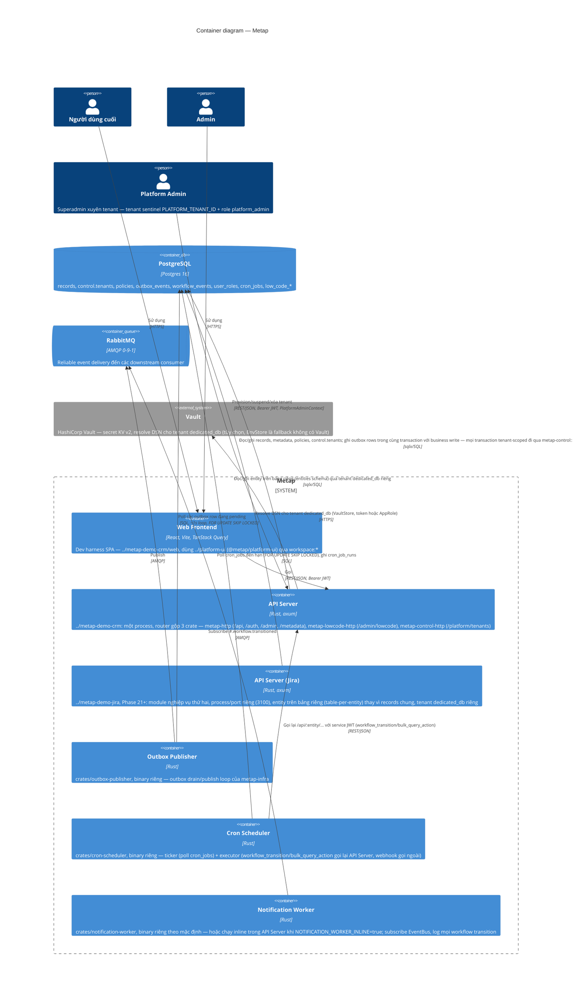
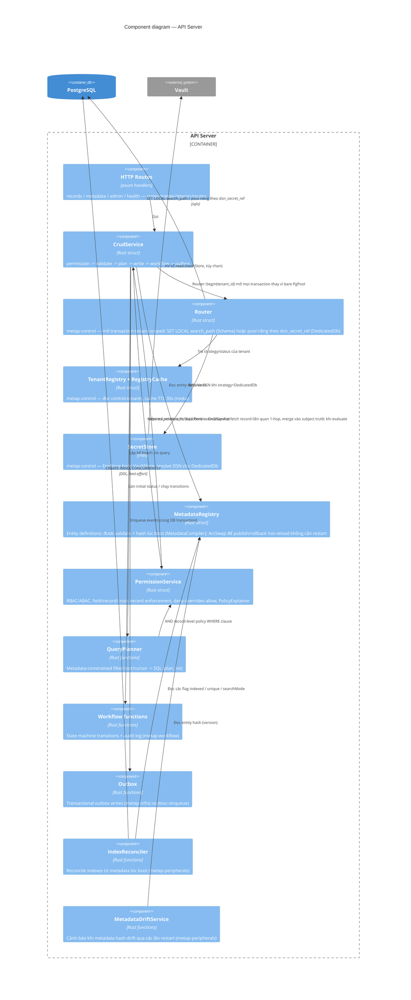

# 5.1 C4 Diagrams (Containers & Components)

[← 5. Building Block View](00-index.md)

## Các layer cấp cao

```txt
axum routes (crates/metap-http/src/routes/*)
  -> application service (crates/metap-crud/src/crud_service.rs)
    -> platform core (metap-metadata / metap-permission / metap-query / metap-workflow)
      -> PostgreSQL (sqlx::PgPool, injected directly — no repository abstraction; see
         docs/architectures/09-adr.md for why)
      -> outbox (metap-infra::outbox::enqueue) -> RabbitMQ (metap-infra::EventBus)
```

## C4 Level 2: Containers



API Server, Outbox Publisher, Cron Scheduler, và Notification Worker (khi không chạy inline) là các process tách biệt một cách có chủ ý — khi RabbitMQ gặp sự cố, chỉ các worker bị ngưng trệ, API không bị ảnh hưởng, vì transactional outbox write đã commit xong rồi. `../metap-demo-crm` có thể tùy chọn phục vụ luôn static files đã build của `../metap-demo-crm/web` trên cùng process/port (`pnpm start`, cấu hình `STATIC_DIR`) — đây chỉ là một tiện lợi khi triển khai, không làm thay đổi sự tách biệt này; các worker vẫn luôn là process riêng biệt (Notification Worker là ngoại lệ duy nhất, có thể chạy inline như một background task trong chính API Server qua `NOTIFICATION_WORKER_INLINE=true` — cả hai chế độ gọi chung một hàm `notification_worker::run`, nên không thể lệch hành vi nhau).

## C4 Level 3: Components (inside the API Server)



