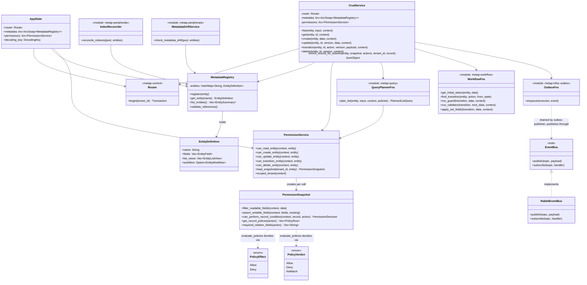

# 5.2 Logical View (class-level)

[← 5. Building Block View](../05-building-blocks.md)

Mô hình object đứng sau component diagram ở [5.1](01-c4-diagrams.md) — các type và cách chúng phụ thuộc lẫn nhau, không phải các đơn vị deploy. (Logical View của Kruchten 4+1.) `metap-query`/`metap-workflow` là các function module chứ không phải struct (không có state cần giữ qua từng call), được thể hiện ở đây như pseudo-class để nhất quán với phần còn lại của diagram.

