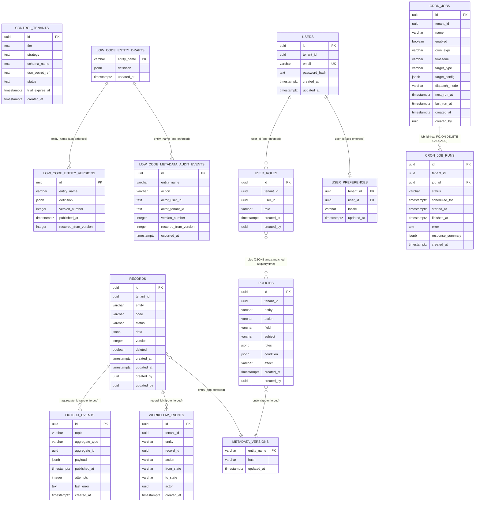

# 5.4 Data Model & Database Design

[← 5. Building Block View](00-index.md)

## Data Model

Metap bắt đầu với một bảng `records` tổng quát:

- các cột ổn định cho field ở cấp hệ thống
- `data jsonb` cho các business field dẫn xuất từ metadata
- các index theo tenant/entity/status
- cột version cho optimistic locking

Điều này giữ được tốc độ phát triển theo hướng metadata-driven. Theo thời gian, các module có khối lượng lớn hoặc quan trọng về mặt kế toán có thể được cấp bảng typed riêng trong khi vẫn dùng chung metadata facade.

Lộ trình phát triển đề xuất:

```txt
Step 1: generic records + JSONB (done)
Step 2: metadata-driven indexes for hot fields (done — see Query Planner,
        03-core-services.md; shipped as per-entity partial expression indexes generated
        by IndexReconciler, not physical generated columns — a shared
        `records` table can't grow one column per possible field name
        across every entity without its column count growing unboundedly)
Step 3: dedicated tables for accounting/inventory critical paths
Step 4: report/materialized views for heavy analytics
```

Step 3-4 chưa được xây dựng và chưa có trigger nào kích hoạt — xem [11. Risks and Technical Debt](../11-risks/00-index.md).

## Database Design (ER diagram)

Các bảng platform/ops (`crates/migrations/*.sql`, được apply qua `sqlx::migrate!` của `db-migrate`) — hầu hết không có ràng buộc foreign key liên bảng: `tenant_id`/`entity`/`aggregate_id`/`record_id` chỉ là các cột thường mà mối quan hệ của chúng được thực thi bởi application code (`QueryPlanner`, `CrudService`), không phải bởi database schema. Đây là chủ ý: `records` là một bảng tổng quát, entity-agnostic duy nhất, nên một FK thật từ ví dụ `workflow_events.record_id` sang `records.id` tuy hoạt động được ở hiện tại nhưng sẽ phải bị bỏ đi ngay khi có một entity bất kỳ được tách ra thành bảng riêng của nó (Step 3 ở trên) — không nên thêm vào trước khi trigger đó xảy ra. Ngoại lệ duy nhất: `cron_job_runs.job_id` có FK thật tới `cron_jobs.id` (`ON DELETE CASCADE`) — hai bảng này là cấu hình platform/ops thuần túy (giống `policies`/`user_roles`, không phải business entity), không nằm dưới ràng buộc "không FK" ở trên.



Ghi chú:

- `records.data` là payload dẫn xuất từ metadata; `code`/`status` là các cột top-level denormalized phản chiếu hai field bên trong `data` (`code` luôn luôn, `status` phản chiếu giá trị của `entity.workflow.stateField`) chỉ nhằm mục đích để chúng có thể được index/query như các cột thật.
- `outbox_events`/`workflow_events` tham chiếu tới các row của `records` theo id (`aggregate_id`/`record_id`) nhưng trên *toàn bộ* bảng tổng quát, không phải theo từng bảng riêng cho mỗi entity — một bảng outbox duy nhất phục vụ mọi entity.
- `policies.roles` là một mảng JSONB được đối chiếu với role của caller tại thời điểm đánh giá (`role_gate_passed`), không phải một relational join tới `user_roles`. `policies.effect` (`"allow"`/`"deny"`, thêm 2026-08-21) quyết định deny-overrides-allow — xem "Permission Service" ở trên.
- `users` (Phase 15, local login) chỉ giữ danh tính (email + `password_hash` argon2id) — **không** giữ role. Role luôn nằm ở `user_roles`, tra mới cho mỗi request, không bao giờ cache trên JWT (xem sequence diagram "Tạo user, đăng nhập, kiểm tra quyền" ở [06. Runtime View](../06-runtime/00-index.md)).
- `control.tenants` sống ở schema Postgres riêng (`control`, không phải `public`) — cố ý tách khỏi mọi bảng nghiệp vụ/platform khác ở trên, vì nó phải đọc được *trước khi* biết tenant nào đang gọi (chính nó là nơi tra `strategy`/`status` để `Router` quyết định route đi đâu). Không có FK từ bảng nào khác tới nó.
- `low_code_entity_drafts`/`low_code_entity_versions`/`low_code_metadata_audit_events` **không có cột `tenant_id`** — định nghĩa entity (kể cả loại DB-authored qua low-code builder) là *toàn cục*, dùng chung cho mọi tenant trong cùng một deployment, không phải per-tenant. Đây là một giới hạn kiến trúc thật của trạng thái hiện tại (multi-tenant SaaS + low-code per-tenant schema là hai trục chưa giao nhau), chưa có trigger để giải quyết.
- Các index thật ngoài các primary key nêu trên được đề cập trong phần "Hot field indexes"/"Full-text search" ở trên — đó là các partial expression index theo từng entity được sinh ra từ metadata, không phải một phần của schema cố định này.

