# 5.5 Service Boundaries & Development View

[← 5. Building Block View](00-index.md)

## Service Boundaries

Không để logic của HTTP, `sqlx`, RabbitMQ, và metadata rò rỉ khắp nơi.

Các phụ thuộc được phép:

```txt
routes -> services
services -> metadata / permission / query / workflow / outbox
metap-infra -> database / messaging
../metap-demo-crm -> crates/metap-* — never the other way around
```

Tránh:

- route/handler code import trực tiếp `sqlx`/`lapin`
- toán tử query từ frontend map trực tiếp sang SQL
- workflow handler publish RabbitMQ trực tiếp
- authorization chỉ tồn tại ở frontend hoặc cấu hình gateway

## Development View (workspace organization)

**Cập nhật 2026-09-04 — không còn 1 repo/2 workspace nữa.** Bảng/mermaid graph dưới đây (kể cả
tên node) vẫn mô tả hình dạng cũ, từ trước đợt tách repo 2026-08-28 → 2026-08-31 (`docs/roadmap/
54-docs-repo-split.md` và các entry Phase 47/51/52 liền trước nó): khi đó `metap` là 1 repo duy
nhất, `apps/` chồng lấn 2 hệ thống workspace (1 Cargo workspace backend + 1 pnpm workspace
frontend). Từ đợt tách đó, `metap-org` là **9 repo riêng biệt** (mỗi cái tự `.git`), không phải 1
repo/nhiều workspace — xem `../../CLAUDE.md` (gốc `metap-org`) cho layout đầy đủ. Cụ thể đổi gì:

- `metap` giờ **chỉ còn** Cargo workspace (`crates/metap-*` + ops binary) — không `apps/`, không
  `pnpm-workspace.yaml`/`package.json` (xoá hẳn, 0 Node/pnpm trong repo này).
- `apps/crm-server`/`apps/jira-server` (cũ) → `../metap-demo-crm`/`../metap-demo-jira`, mỗi cái
  1 repo riêng, phụ thuộc `metap`'s crate qua Cargo **`path` dependency** xuyên repo
  (`metap = { path = "../metap/crates/metap" }`), **không còn là Cargo workspace member** của
  `metap` nữa.
- `packages/platform-react` (Mantine-based, đã xoá hẳn) → `@metap/platform-ui` (repo riêng
  `../platform-ui`, Tailwind + Radix, xây trên `@metap/ui` — repo riêng `../design-system`).
- `apps/crm-fe`/`apps/jira-fe` (cũ) → `../metap-demo-crm/web`/`../metap-demo-jira/web`, mỗi cái
  `pnpm install` độc lập, phụ thuộc `@metap/platform-ui`/`@metap/ui` qua pnpm **`link:`**
  (sibling path thật, không phải `workspace:*` — không còn 1 pnpm workspace chung nào nữa).
- `metap-lowcode`/`metap-lowcode-http`/`metap-control-http`/`reconciler-orchestrator` (bảng cũ
  liệt kê như crate của `metap`) đã chuyển sang repo riêng `../metap-lowcode` (2026-08-31) —
  không còn trong Cargo workspace của `metap` nữa; `metap-demo-crm` là consumer duy nhất còn lại
  của 3 crate đó, qua `path` dependency 2 cấp (`../metap-lowcode/crates/...`).

Bảng/mermaid graph dưới đây **chưa được vẽ lại** cho đúng 9-repo — vẫn còn nguyên giá trị để hiểu
quan hệ phụ thuộc *nội bộ* giữa các crate `metap-*` (phần đó không đổi), chỉ sai ở khung ngoài
("1 repo, 2 workspace", `workspace:*`, và việc liệt kê `metap-lowcode*`/`reconciler-orchestrator`
như thành viên của `metap`). Việc vẽ lại đầy đủ theo 9-repo là việc riêng, chưa làm ở đợt dọn dẹp
này (`docs/roadmap/69-*.md`).

#### Bảng tra cứu nhanh — mọi crate/package (giá trị lịch sử, framing "1 repo/workspace" đã stale — xem cảnh báo trên)

Bảng dưới liệt kê thành viên Cargo/pnpm workspace tại thời điểm còn là 1 repo, mỗi dòng một câu tóm tắt chức năng — dùng để tra cứu nhanh; xem mermaid graph ngay sau bảng để biết quan hệ phụ thuộc giữa chúng, và các bullet chi tiết hơn ở `CLAUDE.md` (gốc `metap`) cho từng crate hiện có (danh sách crate thật hiện tại nằm ở `metap`'s root `Cargo.toml`, đã có thêm `metap-runtime`/`metap-app`/`metap-config` không có trong bảng cũ dưới đây).

**Thư viện entity-agnostic (`crates/metap-*`, Cargo workspace)**

| Crate | Chức năng chính |
|---|---|
| `metap` | Facade crate — re-export mọi `metap-*` bên dưới qua `metap::prelude`; không có logic riêng |
| `metap-infra` | Postgres pool, `EventBus` trait + `RabbitEventBus`, `AppConfig` (đọc `.env`), outbox enqueue, health check |
| `metap-control` | Control plane multi-tenancy: `control.tenants` registry, `Router` (mở transaction/pool theo tenant), `SecretStore` trait — 4 impl (`EnvStore`/`VaultStore`/`AwsSecretsManagerStore`/`GcpSecretManagerStore`), `PostgresPolicyStore` |
| `metap-metadata` | `EntityDefinition`/`EntityField`, `MetadataCompiler` (validate + hash), `MetadataRegistry`, OpenAPI generator |
| `metap-permission` | RBAC/ABAC: `PolicyCondition`, `PermissionService`, `PermissionSnapshot`, `PolicyExplainer` |
| `metap-query` | `QueryPlanner` (`plan_list`), keyset cursor encode/decode, record-level policy → SQL |
| `metap-workflow` | State machine: initial-status resolution, transition lookup, guard evaluation, `workflow_events` audit, outbox emit |
| `metap-reconciler` | Table-per-entity reconciler (`reconcile() = introspect → diff → plan → execute` DDL) + primitive orchestrator đa-tenant (`claim_due`/wave-rollout/`topo_sort_waves`) — thư viện, không tự chạy như service |
| `metap-crud` | `CrudService` — orchestrate permission → validate → plan → write → workflow → outbox cho mọi record operation; `RecordBackend` trait (local-vs-remote dispatch seam, `CrudService` impl in-process) |
| `metap-http` | axum router chính: `/api/:entity*`, `/metadata/*`, `/health`, JWT `AuthContext`/`AdminContext`/`PlatformAdminContext` extractor |
| `metap-jwks` / `metap-jwks-http` | JWKS Ed25519 đa-service (rotation 3 bước) — trust root thay thế static-keypair-per-app; opt-in, chưa binary nào trong repo bật |
| `metap-grpc` | `RecordService` generic CRUD-over-gRPC (server, `GrpcRecordService`) + `GrpcBackend` (client, implement `RecordBackend` bằng gọi mạng thật) |
| `metap-graphql` / `metap-graphql-http` | Schema GraphQL sinh runtime từ `MetadataRegistry` (`async-graphql::dynamic`), DataLoader/complexity-limit/field-mask; `CompositeBackend` route theo entity name xuyên nhiều `RecordBackend` |
| `metap-peripherals` | Index reconciler, metadata drift check, role assignment, `create_user`/`mint_jwt`/`verify_credentials` |
| `metap-lowcode` | Draft/publish/rollback storage cho entity DB-authored (low-code), audit log, import/export |
| `metap-lowcode-http` | Route `/admin/lowcode/entities/*` — crate HTTP riêng, opt-in qua `extra_routes` |
| `metap-control-http` | Route `/platform/tenants*`, `/platform/reconciler/wave-rollout` — crate HTTP riêng, opt-in, `PlatformAdminContext`-gated |
| `metap-storage` | `ObjectStore` trait + `S3ObjectStore` (SeaweedFS hoặc S3-compatible bất kỳ), tenant-scoped key |
| `metap-cache` | `Cache` trait + `MokaCache`/`RedisCache` (RESP-compatible: Redis/DragonflyDB/Valkey), dùng bởi `PermissionService::with_cache` |
| `metap-cron` | `CronJob`/`CronJobRun` storage, cron-expression + timezone math, `claim_due_jobs` |
| `metap-auth` | Pluggable tenant auth: Local (argon2id), HTTP Basic, OIDC redirect/callback + JIT provisioning |
| `metap-attachments` | File attachment gắn trên record (2 cơ chế: bảng chung + bảng riêng theo entity), dùng `metap-storage` |
| `metap-dashboards` | Dashboard config: layout/widget catalog per-user + per-tenant default |

**Ops binaries (built trên `metap-*`, Cargo workspace)**

| Binary | Chức năng chính |
|---|---|
| `outbox-publisher` | Drain/publish worker loop cho `outbox_events` |
| `notification-worker` | Subscribe `EventBus` (`#.workflow.transitioned`), log mọi workflow transition |
| `cron-scheduler` | Ticker (poll `metap-cron`) + executor (`workflow_transition`/`bulk_query_action`/`webhook`/`email`) |
| `reconciler-orchestrator` | Ticker chạy `metap-reconciler::orchestrator` như service thật — claim → topo-sort → reconcile, fan-out cả pool chung lẫn từng tenant `DedicatedDb` |
| `db-migrate` | Áp `crates/migrations/*.sql` qua `sqlx::migrate!` lên database mới |
| `dev-tools` | CLI: `gen-keys`/`mint-token`/`seed-admin`/`create-user`/`provision-tenant`/`bootstrap-platform-admin`/`enqueue-reconcile`/`{vault,aws-secrets,gcp-secrets}-put-dsn` |
| `graphql-gateway` | BFF thật — aggregate GraphQL xuyên nhiều microservice (`jira-server`+`crm-server`), route theo entity qua `CompositeBackend`+`GrpcBackend`, không Postgres/`CrudService` riêng |

**Sample apps (repo riêng, path dependency — KHÔNG còn là Cargo workspace member)**

| App | Chức năng chính |
|---|---|
| `../metap-demo-crm` | Backend thật đầu tiên — entity `crm.customers`/`sales.orders`/`inventory.movements`/`accounting.journal`, gộp mọi crate `metap-*` + `metap-lowcode-http`/`metap-control-http`; opt-in gRPC (`GRPC_ENABLED`) |
| `../metap-demo-jira` | Backend demo thứ hai — table-per-entity end-to-end (`jira.projects`/`sprints`/`issues`/...), tenant `dedicated_db` riêng, port 3100; mount GraphQL (`metap-graphql-http`) + opt-in gRPC cho chính entity của nó |

**Frontend (repo riêng, pnpm `link:` — KHÔNG còn là 1 pnpm workspace chung)**

| Package | Chức năng chính |
|---|---|
| `@metap/platform-ui` (repo riêng `../platform-ui`, Phase 47) | Component dùng chung: api-client, generated list/form, field renderer, `WorkflowActionBar`, `RecordDetail` — không còn trong pnpm workspace này, tiêu thụ qua `link:` |
| `../metap-demo-crm/web` | Dev harness cho `crm-server` (routing, login, trang entity) |
| `../metap-demo-jira/web` | Dev harness cho `jira-server` — thêm `DashboardPage`/`BoardPage` (kanban) |

```mermaid
graph TD
  subgraph cratesmetap["crates/metap-* (Cargo workspace members) — thư viện entity-agnostic"]
    infra["metap-infra<br/>db pool, EventBus trait, config, outbox enqueue"]
    metadata["metap-metadata<br/>EntityDefinition, MetadataCompiler, MetadataRegistry, OpenAPI gen"]
    permission["metap-permission<br/>PolicyCondition, PermissionService, PermissionSnapshot, PolicyExplainer<br/>(trait PolicyStore — impl PostgresPolicyStore sống ở metap-control)"]
    control["metap-control<br/>control.tenants registry, Router, SecretStore (Env/Vault/AwsSecretsManager/GcpSecretManager),<br/>PostgresPolicyStore, provisioning"]
    query["metap-query<br/>plan_list, cursor, condition-to-sql"]
    workflow["metap-workflow<br/>initial status, transitions, guards, audit"]
    cron["metap-cron<br/>cron_jobs/cron_job_runs storage, next_run_at, claim_due_jobs"]
    crud["metap-crud<br/>CrudService: list/get/create/update/transition/delete<br/>(mở transaction qua metap-control::Router)"]
    http["metap-http<br/>axum router: /api/:entity*, /admin/*, /auth/*, /metadata/*, /health, JWT extractor<br/>build_router nhận extra_routes: Router&lt;AppState&gt; — không phụ thuộc lowcode(-http)/control(-http)"]
    peripherals["metap-peripherals<br/>index reconciler, drift check, role assignment, auth (create_user/verify_credentials)"]
    lowcode["metap-lowcode<br/>draft/publish/rollback storage cho DB-authored entity (Phase 11)"]
    lowcodehttp["metap-lowcode-http<br/>/admin/lowcode/entities/* — crate riêng, opt-in qua extra_routes"]
    controlhttp["metap-control-http<br/>/platform/tenants/*, /platform/reconciler/wave-rollout — crate riêng, opt-in qua extra_routes"]
    reconciler["metap-reconciler<br/>reconcile() table-per-entity: introspect/diff/plan/execute DDL (Phase 19/21)<br/>+ orchestrator primitives: claim_due/topo_sort_waves/advance_wave (Phase 44)"]
    storage["metap-storage<br/>ObjectStore trait + S3ObjectStore (S3-compatible, vd SeaweedFS) (Phase 22)"]
    cache["metap-cache<br/>Cache trait + MokaCache/RedisCache, dùng bởi PermissionService::with_cache (Phase 23)"]
    auth["metap-auth<br/>pluggable tenant auth: Local/Basic/OIDC (Phase 25)"]
    attachments["metap-attachments<br/>file attachment trên record, dùng metap-storage"]
    dashboards["metap-dashboards<br/>dashboard_configs: layout/widget catalog per-user + per-tenant default (Phase 33)"]
    jwks["metap-jwks / metap-jwks-http<br/>JWKS Ed25519 đa-service, rotation 3 bước (Phase 49) — opt-in, chưa binary nào bật"]
    grpc["metap-grpc<br/>RecordService: server (GrpcRecordService, gọi CrudService) + client (GrpcBackend, impl RecordBackend qua mạng) (Phase 49-50)"]
    graphql["metap-graphql / metap-graphql-http<br/>schema runtime từ MetadataRegistry, DataLoader/complexity-limit/field-mask,<br/>build_schema nhận Arc&lt;dyn RecordBackend&gt; — CompositeBackend route theo entity (Phase 49-50)"]
  end

  subgraph opsbin["ops binaries (Cargo workspace members, built trên metap-*)"]
    outboxpub["outbox-publisher<br/>drain/publish worker loop"]
    cronsched["cron-scheduler<br/>ticker (poll metap-cron) + executor<br/>(workflow_transition/bulk_query_action gọi lại API, webhook gọi ngoài)"]
    notifworker["notification-worker<br/>subscribe #.workflow.transitioned, log — chạy độc lập hoặc inline trong crm-server"]
    dbmigrate["db-migrate<br/>sqlx::migrate! over crates/migrations"]
    devtools["dev-tools<br/>gen-keys / mint-token / seed-admin / create-user /<br/>provision-tenant / bootstrap-platform-admin / enqueue-reconcile / *-put-dsn"]
    reconcilerorc["reconciler-orchestrator<br/>ticker chạy metap-reconciler::orchestrator như service (Phase 44):<br/>claim → topo-sort → reconcile, fan-out pool chung + từng tenant DedicatedDb"]
    gateway["graphql-gateway<br/>(package metap-graphql-gateway, Phase 50) BFF thật — aggregate GraphQL xuyên nhiều microservice,<br/>không Postgres/CrudService riêng, tự axum app riêng"]
  end

  subgraph appscrmserver["../metap-demo-crm (Cargo + pnpm member) — module nghiệp vụ đầu tiên"]
    customerentity["src/entities/customer_entity.rs"]
    mainrs["src/main.rs<br/>inline wiring, boot sequence — gộp cả metap-http + lowcode-http + control-http"]
  end

  subgraph appsjiraserver["../metap-demo-jira (Cargo member, Phase 21+) — module nghiệp vụ thứ hai, PoC table-per-entity"]
    issueentity["src/entities/issue_entity.rs, project/sprint/comment_entity.rs"]
    jiramainrs["src/main.rs<br/>reconcile() các entity lên bảng riêng lúc boot, port 3100 riêng"]
  end

  subgraph pkgplatform["../platform-ui (@metap/platform-ui) (pnpm workspace member)"]
    platform["GeneratedList/Form, FieldValue/Input,<br/>WorkflowActionBar, RecordDetail, api-client"]
  end

  subgraph appscrmfe["../metap-demo-crm/web (pnpm workspace member)"]
    demoapp["src/App.tsx, src/demo/*<br/>React + Vite + TanStack Query"]
  end

  http --> crud
  crud --> metadata
  crud --> permission
  crud --> query
  crud --> workflow
  crud --> infra
  crud --> control
  control --> permission
  control --> peripherals
  lowcode --> metadata
  lowcode --> permission
  lowcodehttp --> lowcode
  lowcodehttp -.->|"đọc/ghi AppState metadata qua metap-http, không import ngược"| http
  controlhttp --> control
  controlhttp -.->|"đọc AppState router qua metap-http, không import ngược"| http
  mainrs -->|"phụ thuộc vào"| http
  mainrs -->|"phụ thuộc vào"| infra
  mainrs -.->|"opt-in: merge metap::lowcode_http::router + control_http::router vào build_router"| lowcodehttp
  mainrs -.->|"opt-in"| controlhttp
  customerentity -.->|"entity definition, không có business knowledge của metap-*"| mainrs
  issueentity -.->|"entity definition"| jiramainrs
  jiramainrs -->|"phụ thuộc vào"| http
  jiramainrs -->|"reconcile() lúc boot"| reconciler
  mainrs -.->|"cả 4 entity code-authored (crm.customers/sales.orders/inventory.movements/accounting.journal) đều table-per-entity (Phase 36+45)"| reconciler
  http --> auth
  http --> storage
  http --> attachments
  http --> dashboards
  attachments --> storage
  permission --> cache
  outboxpub --> infra
  cronsched --> cron
  cronsched -.->|"gọi lại /api/:entity qua HTTP với service JWT, không link metap-crud/metap-metadata trực tiếp"| mainrs
  notifworker --> infra
  dbmigrate --> infra
  devtools --> infra
  devtools --> control
  devtools -.->|"enqueue-reconcile"| reconciler
  reconcilerorc --> control
  reconcilerorc --> reconciler
  reconcilerorc -.->|"metap_lowcode::get_published — chỉ entity DB-authored đã publish"| lowcode
  controlhttp -.->|"POST /platform/reconciler/wave-rollout bọc advance_wave"| reconciler
  demoapp -->|"link: (sibling repo, KHÔNG phải workspace:*)"| platform
  demoapp -.->|"chỉ qua HTTP, không bao giờ import Rust code"| http
  grpc --> crud
  graphql --> crud
  graphql -.->|"generic hoá playground_router&lt;S&gt;, router() nhận AppState"| http
  jiramainrs -.->|"mount metap-graphql-http::router() cho chính entity của jira"| graphql
  jiramainrs -.->|"opt-in GRPC_ENABLED, tokio::spawn(metap_grpc::serve), port riêng"| grpc
  mainrs -.->|"opt-in GRPC_ENABLED (Phase 50, mirror jira-server) — không mount GraphQL riêng"| grpc
  gateway -->|"CompositeBackend build_schema"| graphql
  gateway -->|"1 GrpcBackend mỗi upstream"| grpc
  gateway -.->|"GET /metadata/entities thật, bearer service JWT"| jiramainrs
  gateway -.->|"GET /metadata/entities thật, bearer service JWT"| mainrs
```



`../metap-demo-crm` phụ thuộc vào `crates/metap-*`; không có crate `metap-*` nào có đường phụ thuộc quay ngược lại `../metap-demo-crm` hay bất kỳ package `apps/*` nào khác — chính hướng phụ thuộc này giữ cho `metap-*` thực sự entity-agnostic, chứ không chỉ mang tính quy ước. `../metap-demo-crm/web` là phần tương đương bên frontend: nó chỉ có thể tiếp cận backend qua HTTP (đường nét đứt), không bao giờ bằng cách import backend code, và nó dùng `../platform-ui (@metap/platform-ui)` theo cùng cách `../metap-demo-crm` dùng `crates/metap-*`. `metap-control` (control plane multi-tenancy) phụ thuộc `metap-peripherals` để có `Router::begin` khớp với cùng hạ tầng user/role — chiều phụ thuộc `metap-permission -> metap-control` sẽ khép vòng lặp, đó là lý do `PostgresPolicyStore` sống ở `metap-control` dù trait `PolicyStore` nó implement thì ở `metap-permission`. `../metap-demo-jira` là module nghiệp vụ thứ hai (Phase 21+), cùng hình dạng phụ thuộc như `../metap-demo-crm` (chỉ phụ thuộc `crates/metap-*`, không có crate nào phụ thuộc ngược lại nó) — điểm khác biệt duy nhất là nó gọi thẳng `metap-reconciler::reconcile()` lúc boot để đưa entity của mình lên bảng riêng (table-per-entity) thay vì dùng bảng `records` chung.
