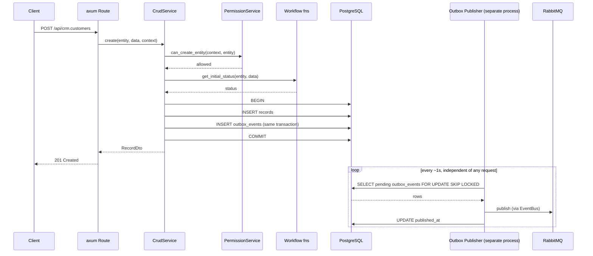
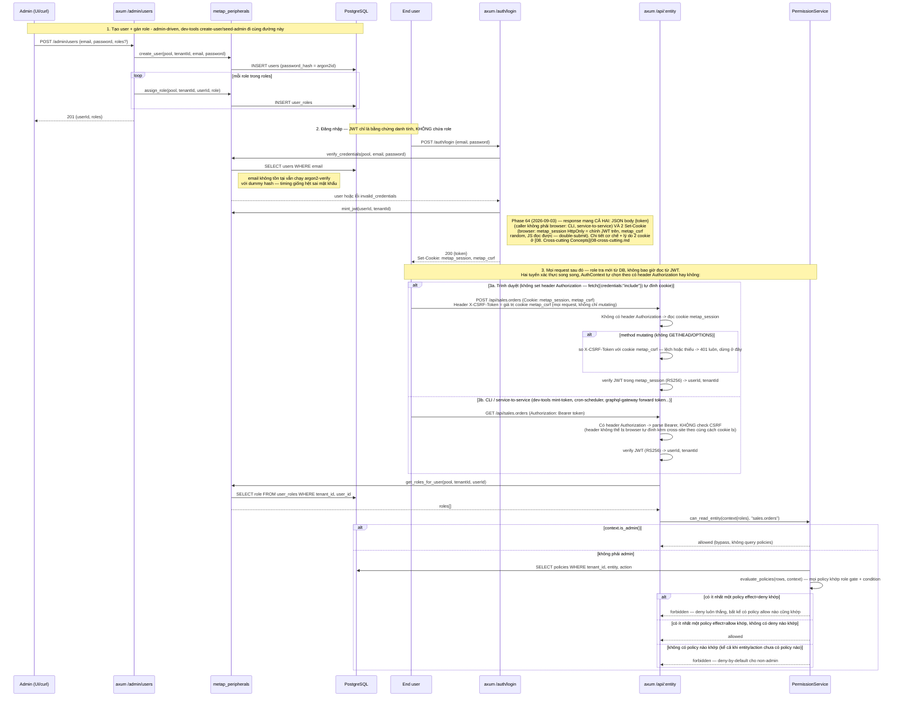

# 6. Runtime View

## Concurrency: hai process độc lập

API Server và Outbox Publisher chỉ kết nối với nhau qua PostgreSQL (transactional outbox) và RabbitMQ — không bao giờ gọi trực tiếp lẫn nhau. Sequence diagram bên dưới mô tả một request `create()` (process API Server) chạy song song với vòng lặp polling của Outbox Publisher (process riêng biệt). (Process View của Kruchten 4+1.)

Nếu RabbitMQ bị down, vòng lặp trên chỉ tiếp tục fail và retry — request `create()` đã commit và trả về xong trước khi vòng lặp đó chạy, nên tính khả dụng của API không bao giờ phụ thuộc vào việc RabbitMQ có đang chạy hay không.

## Tạo user, đăng nhập, và kiểm tra quyền

Ba việc thường bị nhầm là một, nhưng là ba cơ chế tách biệt: **tạo user** (danh tính), **đăng
nhập** (mint JWT), và **kiểm tra quyền** (chạy lại ở server cho *mỗi* request, không đọc từ
JWT). Sequence dưới đây gộp cả ba để thấy rõ chúng nối với nhau ở đâu:

Ghi chú:

- **Cookie session là tuyến chính cho browser, Bearer vẫn nguyên vẹn cho tất cả caller khác**
  (Phase 64, 2026-09-03 — [09. Architecture Decisions](09-adr.md)) — đây là đảo ngược một quyết
  định cũ có chủ đích ("JWT chỉ sống trong React state, mất khi F5"), không phải sửa lỗi. Header
  `Authorization` luôn thắng khi có mặt (nhánh 3b ở trên) nên toàn bộ CLI/service-to-service không
  đổi gì. `GET /auth/token` (route riêng, dùng `AuthContext` nên chạy được dù caller vào bằng
  cookie hay Bearer) mint 1 JWT ngắn hạn cho `graphql-gateway` — service này tự keypair/tự CORS
  riêng, không tham gia cơ chế cookie. `POST /auth/logout` xoá cả 2 cookie (`Max-Age=0`) phía
  server — client không tự xoá được cookie `HttpOnly`. Cơ chế double-submit CSRF + lý do 2 cookie
  tách biệt (`metap_session` HttpOnly, `metap_csrf` không) ở
  [08. Cross-cutting Concepts](08-cross-cutting.md#cookie-session-and-csrf).
- **Mô hình phân quyền là deny-by-default cho non-admin, với deny-overrides-allow** (đổi từ
  "opt-in restriction" ngày 2026-08-21, xem [09. Architecture Decisions](09-adr.md)): một
  `(entity, action)` chưa có policy nào thì **không ai được phép** (trừ `admin`, luôn bypass toàn
  bộ bước này) — ngược hẳn với hành vi cũ. `POST /admin/policies/seed-defaults` là cách nhanh để
  bulk-tạo policy allow cho một role mới trên một entity, tránh phải gọi `create_policy` từng
  action một khi onboard. Mỗi policy còn mang một `effect` (`allow`/`deny`, cột `policies.effect`)
  — nếu có ít nhất một policy `deny` khớp (role gate + condition) thì bị từ chối ngay, bất kể có
  bao nhiêu policy `allow` cũng khớp; ngược lại cần ít nhất một `allow` khớp mới được phép. Hàm
  `metap_permission::evaluate_policies` là nơi duy nhất quyết định thứ tự ưu tiên này — mọi entry
  point (entity-level `check_action`, field-level `filterReadableFields`/`writableFields`,
  record-level `can_perform_record_condition`, và bản dịch sang SQL
  `record_policy_where_clause` cho `list()`) đều đi qua nó. Chi tiết ở
  [08. Cross-cutting Concepts](08-cross-cutting.md#permission-enforcement).
- Có 3 tầng policy, phân biệt bằng cột `field`/`subject` của bảng `policies` (xem ER diagram ở
  [05. Building Block View](05-building-blocks/04-data-model.md#database-design-er-diagram)): **context-level**
  (`field`/`subject` đều rỗng — gác toàn bộ action trên entity), **field-level** (`field` có giá
  trị, `action` là `"read"` để mask lúc đọc hoặc `"write"` để chặn lúc ghi), **record-level**
  (`subject: "record"` — dịch thành mệnh đề SQL `WHERE` trong `QueryPlanner`, lọc row nào hiện ra
  trong `list()`). `action` có 5 giá trị: `read`/`create`/`update`/`delete`/`transition` — sửa
  field và chuyển workflow state là hai action tách biệt (`transition` != `update`, từ
  2026-08-21) nên một role có thể sửa field mà không được transition, hoặc ngược lại.
- Điều kiện của một policy `record`-level có thể tham chiếu sang một record khác qua dotted
  attribute path (vd `"referredBy.status"`, resolve 1-hop qua field kiểu `Reference`) — chỉ áp
  dụng cho thao tác trên một record đơn (`get`/`update`/`transition`/`delete`), **không** áp dụng
  cho `list()` (`metap-query` reject rõ ràng nếu gặp dotted path trong policy dùng cho `list()`,
  vì SQL path chưa hỗ trợ join). Xem [05. Building Block View](05-building-blocks/03-core-services.md#permission-service).
- `users` và `user_roles` là hai bảng tách biệt có chủ đích (xem ghi chú ở ER diagram) — một user
  có thể tồn tại (đăng nhập được) mà chưa có role nào, hoặc có nhiều role cùng lúc.
- **Cách kiểm chứng cả luồng này** — `apps/crm-server/scripts/permission-smoke.sh` chạy qua HTTP
  thật, đủ cả 3 tầng policy + admin route gating (401/403) + `PolicyExplainer`, tự dọn state sau
  mỗi lần chạy. Không phải test suite được commit, chỉ là script lặp lại được cho việc poke thủ
  công — xem `docs/CONTRIBUTING.md`.

## Scenarios

Các scenario dùng để kiểm chứng những building block ở trên, làm cơ sở cho các e2e test chạy trên DB thật của codebase này (`cargo test --workspace -- --ignored`, cần `DATABASE_URL` + một Postgres/RabbitMQ dev đang chạy). (Phần "+1" của Kruchten 4+1 — các scenario dùng để xác thực những view còn lại.)

- **Tạo một record** — `CrudService` → `PermissionService` → workflow fns → outbox `enqueue`, gói gọn trong một transaction PostgreSQL. Sequence: như trên.
- **Update với version đã lỗi thời** — cùng luồng như create, nhưng `WHERE version = $expected_version` của `CrudService::update` khớp 0 dòng, trả về `409 version_conflict` thay vì âm thầm ghi đè lên một write đang diễn ra đồng thời.
- **Workflow transition** — `find_transition` + `run_guard` (một phép đánh giá `PolicyCondition`) gác cổng cho việc đổi state; khi thành công, một dòng `workflow_events` dạng append-only được ghi và một outbox event `<entity>.workflow.transitioned` được enqueue trong cùng transaction với scenario create.
- **List có filter, full-text search, và keyset pagination** — thực thi toàn bộ `plan_list`: filter bị ràng buộc bởi metadata, nhánh `searchMode: "fts"`, mệnh đề `WHERE` của policy ở mức record, và một cursor được kiểm tra khớp với sort đã resolve — tất cả được AND lại thành một query duy nhất, chạy trên các index mà `IndexReconciler` duy trì.
- **Admin cấp một role** — `POST /admin/users/{userId}/roles` (chỉ admin mới gọi được, `crates/metap-http/src/routes/admin.rs`) ghi một dòng `user_roles` qua `metap_peripherals::assign_role`; request tiếp theo của user đó nhận role mới ngay lập tức (role luôn được đọc mới ở mỗi request, không bao giờ cache trong JWT).
