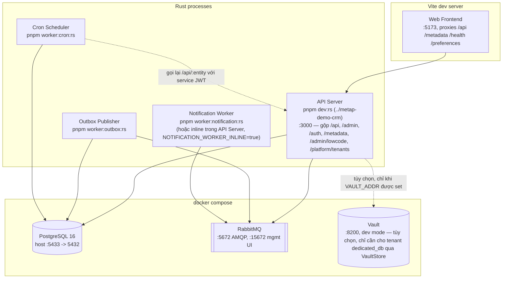

# 7. Deployment View

Topology triển khai cho local development (`docker compose` + các process Rust chạy qua `cargo run` trực tiếp). Production chưa được xây dựng ([Phase 8: Hardening](../../roadmap.md) đang tiến hành — đã có `Dockerfile` non-root và CI, nhưng chưa có topology triển khai production/orchestrator/secrets-manager thực sự) — tài liệu này phản ánh setup dev thực tế hiện tại, không phải một topology production mục tiêu. (Physical View của Kruchten 4+1.)

**Cập nhật 2026-09-04**: mermaid graph + ghi chú dưới đây còn nhắc `pnpm dev:rs`/`pnpm dev:web`/
`pnpm worker:*:rs`/`pnpm start` — các script `package.json` gốc `metap` đã bị **xoá hẳn** cùng đợt
tách repo (`metap` giờ 0 Node/pnpm). Lệnh thật hiện tại: `cd ../metap-demo-crm && cargo run` (API,
:3000), `cd ../metap-demo-crm/web && pnpm dev` (:5173), `cargo run --manifest-path
../metap/crates/outbox-publisher/Cargo.toml`/`cron-scheduler`/`notification-worker` tương tự (hoặc
chạy inline qua `OUTBOX_WORKER_INLINE`/`NOTIFICATION_WORKER_INLINE`, xem README từng repo) — xem
`../05-building-blocks/00-index.md`'s ghi chú Development View cho layout 9-repo đầy đủ. Cũng
xem `docker-compose.dev.yml` mới ở gốc từng repo (`docs/roadmap/69-*.md`) cho 1 lệnh hot-reload
thay cho việc gõ tay từng lệnh trên.

## Ghi chú

- API Server, Outbox Publisher, Cron Scheduler, và Notification Worker hiện là các binary/process riêng biệt, chưa phải các container riêng — mỗi cái đều có thể được đóng container độc lập mà không cần sửa code, vì chúng vốn đã chỉ giao tiếp qua PostgreSQL/RabbitMQ/HTTP.
- **Phương án chạy đơn process**: `pnpm start` build `../metap-demo-crm/web` rồi trỏ config `STATIC_DIR` của `../metap-demo-crm` vào thư mục output build đó, để API server tự phục vụ luôn các static file của frontend, chạy đơn process/đơn port. Đây là một chế độ tiện lợi khi triển khai, không phải phương án thay thế cho workflow dev tách rời ở trên (`pnpm dev:web` + `pnpm dev:rs`) — Outbox Publisher/Cron Scheduler không bao giờ bị gộp vào chế độ này, luôn là process riêng biệt dù chạy theo cách nào; Notification Worker là ngoại lệ duy nhất, có thể chạy inline trong API Server (`NOTIFICATION_WORKER_INLINE=true`) hoặc như process riêng — cả hai gọi chung một hàm `notification_worker::run` nên không lệch hành vi.
- Chưa có tài liệu mô tả topology triển khai production — chưa có orchestrator (Kubernetes, ECS, v.v.), chưa có load balancer, chưa có autoscaling. Đây là khoản nợ kỹ thuật có thật, đã được ghi nhận — xem [11. Risks and Technical Debt](../11-risks/00-index.md).
- `docker compose` ở đây chỉ là tiện ích cho local dev, không phải mục tiêu triển khai — `docker-compose.yml` chạy `postgres`, `rabbitmq` mặc định, cộng thêm các service opt-in cho từng feature cụ thể: `vault` (`VaultStore`, dedicated_db tenant), `dragonfly` (`metap-cache`'s `RedisCache`, Phase 23), `seaweedfs` (`metap-storage`'s `S3ObjectStore`, Phase 22), `mailhog` (`TargetType::Email` gửi SMTP, Phase 39, xem port 8025 để đọc email test). API/worker/frontend đều chạy dưới dạng process thuần trên host — không có gì trong docker-compose đóng vai trò datastore/broker chính ngoài `postgres`/`rabbitmq`.
- **`../metap-demo-jira`** (Phase 21+) chạy như một process Rust riêng thứ hai, cạnh `../metap-demo-crm` — `cargo run -p jira-server` hoặc `pnpm dev:jira:rs`, port 3100 (không đụng port 3000 của crm-server), có thể tùy chọn chạy `outbox-publisher`'s drain loop inline (`OUTBOX_WORKER_INLINE=true`) vì tenant `dedicated_db` của nó cần drain riêng.
- Mỗi tenant `dedicated_db` cần đúng một service-account (`CRON_SERVICE_EMAIL`/`CRON_SERVICE_PASSWORD`)/executor để Cron Scheduler thực thi job của tenant đó — claim `tenantId` của token account đó cố định tenant nào một executor chạy được (ràng buộc đã biết, không phải lỗ hổng bảo mật — một job có `tenant_id` không khớp fail lúc thực thi, không tìm thấy record/entity). Token tự login qua `POST /auth/login` + tự refresh nền (`metap_runtime::service_token::ServiceTokenSource`, 2026-09-02) — thay cho `CRON_SERVICE_JWT` tĩnh mint tay trước đó.

### Secret manager — `SecretStore` + `VaultStore` (2026-08-17 → 2026-08-21)

`metap-control`'s `SecretStore` trait (`crates/metap-control/src/secret_store.rs`, xây cho
Phase 16's `DedicatedDb` tenant strategy) — `async fn db_credentials(&self, dsn_secret_ref: &str)
-> anyhow::Result<DbCreds>`, trả `DbCreds{dsn: SecretString, expires_at: Option<Instant>}`.
Hai impl hôm nay:

- **`EnvStore`** — đọc DSN thẳng từ biến môi trường tên đúng bằng `dsn_secret_ref`, mặc định
  khi `VAULT_ADDR` không được set. `expires_at` luôn `None`.
- **`VaultStore`** (`crates/metap-control/src/vault_store.rs`) — static KV v2 secret qua HTTP
  API của Vault. Hai auth method: token tĩnh (`VAULT_TOKEN`) hoặc AppRole
  (`VAULT_ROLE_ID`/`VAULT_SECRET_ID`, ưu tiên nếu có cả hai) kèm auto-renewal (re-login khi còn
  dưới 60s là hết hạn, không cần background task riêng). `../metap-demo-crm/src/main.rs` chọn
  đúng một trong hai `SecretStore` **một lần lúc boot** — không có fallback runtime giữa
  chúng (xem "Open questions" bên dưới).

Vẫn chưa làm: dynamic database-credentials engine thật của Vault (rotating creds, không phải
static DSN — `expires_at` đã có chỗ chứa nhưng chưa impl nào trả `Some`); mở rộng
`AppConfig` (`metap-infra::config`, đọc `DATABASE_URL`/`RABBITMQ_URL`/JWT key path) qua cùng
abstraction — hiện đó vẫn là dotenv/env thuần, tách biệt với `SecretStore` (vốn chỉ phục vụ
`Router` resolve DSN tenant `dedicated_db` lúc runtime).

#### Vault production readiness — open questions (2026-08-21, chưa trả lời)

`VaultStore` chứng minh được cơ chế (mint/resolve secret qua Vault hoạt động đúng), nhưng
**vận hành Vault ở production là một mảng riêng, chưa được thiết kế** — ba câu hỏi tối thiểu
dưới đây hiện chưa có câu trả lời nào trong repo, ghi lại rõ để không ai lầm tưởng "có
`VaultStore` là Vault đã production-ready":

- **Vault chết thì lấy secret từ đâu?** Không có gì — `SecretStore` được chọn một lần lúc boot,
  không fallback runtime. Vault down khiến mọi tenant `dedicated_db` không mở được pool mới
  (`Router::dedicated_pools`, idle TTL 10 phút — pool đã mở vẫn sống tới khi bị evict).
- **KMS/recovery material mất thì recover thế nào?** Chưa thiết kế. Dev Vault hiện chạy `dev`
  mode (auto-unseal bằng root token cố định, không Shamir shard) — production cần auto-unseal
  qua cloud KMS hoặc Shamir, chưa có ở đâu trong repo.
- **Đã restore một snapshot Vault thành công chưa?** Chưa từng — có drill backup/restore cho
  Postgres (Phase 8, `../metap-demo-crm/scripts/backup-restore-drill.sh`) nhưng chưa có gì tương
  đương cho Vault.

Best-practice sản xuất tham khảo khi trigger triển khai production thật xảy ra:

- HA thật (cluster Raft integrated storage ≥3 node hoặc Consul backend) — không bao giờ 1 node.
- Auto-unseal qua cloud KMS (AWS/GCP/Azure) thay vì unseal tay bằng Shamir key.
- Snapshot định kỳ (`vault operator raft snapshot save`) **và** drill restore thật định kỳ —
  chưa từng restore thử thì coi như chưa có backup.
- AppRole least-privilege: mỗi service một role, policy hẹp nhất có thể (đã đúng hướng —
  `metap-dsn-read` chỉ read đúng path); `secret_id` ngắn hạn/one-time do pipeline
  secrets-injection cấp, không gen tay qua CLI như dev hiện tại.
- Audit log bật, TLS bắt buộc, không expose UI/API ra ngoài không qua network policy.
- Root token mint xong cất offline, gần như không dùng trong vận hành thường ngày — token cố
  định của dev Vault chỉ chấp nhận được cho dev.

Trigger để thực sự làm: khi một target triển khai production được chốt (xem đầu mục Ghi chú
ở trên) — cả secret-manager lẫn HA/DR đều là quyết định thuộc về lúc chọn hạ tầng production
thật, không phải thứ đoán trước được ở giai đoạn hiện tại.
